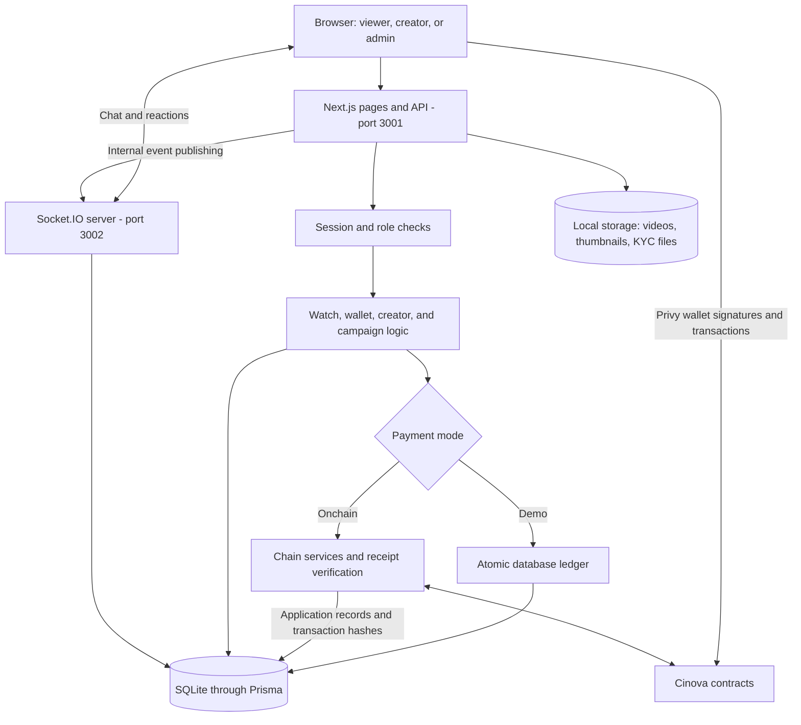
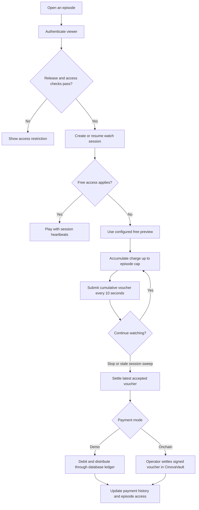
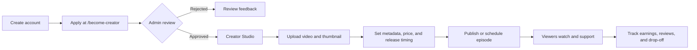
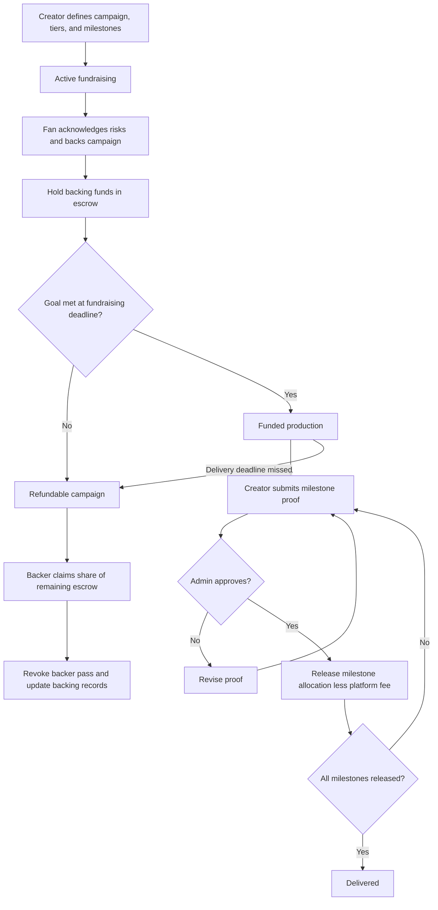

# Cinevo

**Watch independent films, support their creators, and help fund what comes next.**

Cinevo combines filmmaker channels, pay-per-minute viewing, subscriptions, live premiere rooms, and milestone-based crowdfunding. Creators publish films and track earnings; fans watch, tip, subscribe, and back productions; administrators review creators, identity submissions, campaign milestones, and reports.

The default mode uses a local demo ledger with simulated money. An optional onchain mode connects the payment flows to Solidity contracts through Privy wallets. The app is named **Cinevo**; the contract package and contract names use **Cinova**.

## Contents

- [Features](#features)
- [Architecture](#architecture)
- [Quick start](#quick-start)
- [Configuration](#configuration)
- [Application workflows](#application-workflows)
- [Money and access rules](#money-and-access-rules)
- [Onchain mode](#onchain-mode)
- [Project structure](#project-structure)
- [Commands and validation](#commands-and-validation)
- [Deployment and current limitations](#deployment-and-current-limitations)
- [Troubleshooting](#troubleshooting)

## Features

| Audience | Capabilities |
| --- | --- |
| Viewers | Discover films and trending titles, watch free or metered episodes, manage a wallet, subscribe to channels, tip creators, and leave watch-qualified reviews. |
| Backers | Choose perk tiers or eligible Producer Units, receive backer passes, follow milestone progress, claim available refunds, and claim revenue shares. |
| Creators | Apply for approval, upload videos and thumbnails, configure pricing and release timing, run campaigns, submit milestone proof, manage emotes and moderators, reply to reviews, and inspect earnings and drop-off data. |
| Premiere participants | Join live chat, send reactions, contribute to hype levels, and see highlighted tips. |
| Administrators | Approve or reject creator and KYC submissions, review milestone proof, and handle reports. |

## Architecture

| Layer | Repository implementation |
| --- | --- |
| Web application | Next.js 14 App Router, React 18, TypeScript, Tailwind CSS |
| API and validation | Next.js route handlers, Zod |
| Database | Prisma 6 with SQLite |
| Demo authentication | bcrypt password hashing and an HTTP-only JWT session cookie |
| Realtime service | Separate Node.js process using Socket.IO |
| Media | Local disk storage with session-checked video delivery and HTTP Range support |
| Optional wallet integration | Privy and viem |
| Smart contracts | Solidity 0.8.28, Hardhat 3, OpenZeppelin 5 |



Both modes use the database for application state. In onchain mode, contract balances and settlement are authoritative for money, while the database stores the application records used by history and dashboards.

## Quick start

### 1. Prerequisites

- Node.js **22.13 or later on the Node 22 release line**, with npm. The app's installed `concurrently` package requires Node 22+, and the installed Hardhat version requires at least 22.13.
- A writable local filesystem for SQLite and uploads.
- Ports **3001** and **3002** available.

Demo mode requires no wallet, blockchain node, Privy account, or separate database server. Run the following commands from the `Cinevo/` directory containing `package.json`.

### 2. Create your environment file

Copy [.env.example](.env.example) to `.env` **if `.env` does not already exist**. Preserve any existing configuration.

PowerShell:

```powershell
Copy-Item .env.example .env
```

macOS / Linux:

```bash
cp .env.example .env
```

Set `JWT_SECRET` and `INTERNAL_SECRET` to your own values. Leave `NEXT_PUBLIC_CHAIN_MODE` unset for demo mode.

### 3. Install and initialize

```bash
npm ci
npx prisma migrate deploy
npm run db:seed
npm run dev
```

`npm ci` also generates Prisma Client through the `postinstall` script. The migration command applies the checked-in migrations; the seed adds demo accounts, creators, episodes, and campaigns.

Open **[http://localhost:3001](http://localhost:3001)**. The development command starts Next.js and the realtime service together. Port 3002 is used by the application rather than as a separate web page.

### 4. Try the demo accounts

All accounts below use the password **`password123`** in demo mode.

| Email | Role / scenario | Initial demo wallet |
| --- | --- | --- |
| `viewer@cinevo.app` | Viewer | INR 2,000 |
| `fan2@cinevo.app` | Second viewer | INR 1,500 |
| `priya@cinevo.app` | Approved creator, Priya Films | No seeded grant |
| `rahul@cinevo.app` | Approved creator, Rahul Reels | No seeded grant |
| `investor@cinevo.app` | US-region, KYC-verified Producer Unit participant | INR 10,000 |
| `admin@cinevo.app` | Administrator | No seeded grant |

You can also register at `/signup`. In demo mode, logging in with a new email and a nonempty password automatically creates an account with INR 500 in demo credit. Existing accounts require their correct password; the dedicated signup form requires at least eight password characters.

A useful walkthrough is to watch and tip as a viewer, inspect earnings as a creator, and open `/admin` as the administrator. Use the investor account to explore the region- and KYC-gated backing flow.

## Configuration

The template is [.env.example](.env.example). These are the core settings read by the application:

| Variable | Purpose |
| --- | --- |
| `DATABASE_URL` | SQLite connection string; `file:./dev.db` resolves relative to the Prisma schema directory. |
| `JWT_SECRET` | Required session-signing secret, shared by the web and realtime processes. |
| `INTERNAL_SECRET` | Shared secret for internal realtime event publishing. |
| `REALTIME_PORT` | Realtime listener port; defaults to `3002`. |
| `REALTIME_SERVER_URL` | Server-side address used by Next.js to publish realtime events. |
| `NEXT_PUBLIC_APP_URL` | Browser-facing app origin; also used for realtime origin configuration. |
| `NEXT_PUBLIC_REALTIME_URL` | Browser-facing Socket.IO endpoint. |

The npm scripts fix the web port at `3001`; changing `NEXT_PUBLIC_APP_URL` alone does not change the listening port. Additional payment settings are documented under [Onchain mode](#onchain-mode).

## Application workflows

### Watching and payment settlement

Access is checked before a session starts. Draft and scheduled episodes are unavailable; premieres and early-access episodes require an active creator subscription or an eligible backer pass. Public episodes use their free/paid configuration and the viewer's accumulated payment status.



Uploaded videos are served through `/api/media/video/[sessionToken]`, with session and heartbeat checks. The seeded sample videos use external public URLs and do not have the same delivery protection.

### Creator onboarding and publishing



Creator verification and viewer KYC are separate workflows. Creator approval enables publishing; KYC and region eligibility govern Producer Units. In onchain mode, creators need a linked wallet before approval can register them onchain.

### Campaign funding, milestones, and refunds



A failed fundraising goal allows full refunds. If production fails after milestone payouts, refunds are proportional to the **unreleased escrow**; already released funds are not returned.

### Premiere interaction

The browser joins an episode room through Socket.IO. The realtime service verifies the session, applies chat/access rules, persists interaction data, and broadcasts updates. REST handlers can also publish events to the service, such as highlighted tips. Creator moderators can manage chat through the moderation features.

## Money and access rules

The main application constants live in [lib/constants.ts](lib/constants.ts). Contract configuration is maintained separately; see [contracts/README.md](contracts/README.md).

| Rule | Current application behavior |
| --- | --- |
| Currency | Demo amounts are integer paise, displayed as INR. Onchain amounts use a six-decimal USD token and a configured conversion rate. |
| Metered viewing | Rate range of INR 0.10–2.00 per minute; default preview of 120 seconds. |
| Voucher cadence | Every 10 seconds; sessions become eligible for stale settlement after 60 seconds without a fresh voucher. Actual settlement waits for a sweep. |
| Price cap | A per-episode cap limits payment; reaching it grants free rewatches. |
| Standard split | Tips, subscriptions, and ordinary viewing revenue use a 90% creator / 10% platform split. |
| Subscriptions | Accrue per second using a 30-day month; charges are applied lazily on interactions or sweeps. Insufficient funds pause the subscription. |
| Withdrawals | A request has a 10-minute delay before completion; pending requests can be cancelled. |
| Producer Unit eligibility | KYC approval and a permitted region; the application's current region allowlist contains `US`. |
| Producer Unit size and cap | INR 100 per unit; maximum INR 5,000 per person per film in the application defaults. |
| Review eligibility | Watch at least 50% of a film, or 100% when its duration is under 10 minutes. |

For an episode linked to a Producer Unit campaign, viewing revenue follows this waterfall:

| Stage | Unit holders | Creator | Platform |
| --- | --- | --- | --- |
| Until holders receive 120% of contributed principal | 50% | 40% | 10% |
| After that threshold | 20% | 70% | 10% |

Unit holders claim accumulated revenue from the campaign. These percentages describe allocation rules, not a promise of returns. The contracts currently make Producer Units non-transferable; the application's lock-up constant does not provide a secondary market.

## Onchain mode

Onchain mode uses Privy login and embedded wallets, signed EIP-712 viewing vouchers, and receipt-verified transactions. The server operator handles actions such as publishing episode configuration, creator approval, and milestone releases. Gas sponsorship is requested by the client by default and requires a working provider configuration.

The repository configures **Monad testnet, chain ID 10143**, and a **local Hardhat chain, ID 31337**. The checked-in deployment file currently contains local-chain addresses only; it is not evidence of a running node or a Monad deployment.

### Monad testnet setup

1. Configure a Privy application for the email/Google login methods used by the app, embedded wallets, the target chain, and any required gas sponsorship.
2. Prepare a testnet-funded deployer/operator wallet.
3. Install, compile, test, and deploy the contract package:

```bash
cd contracts
npm ci
npx hardhat keystore set MONAD_TESTNET_RPC_URL
npx hardhat keystore set MONAD_DEPLOYER_PRIVATE_KEY
npm run build
npm test
npm run deploy:monad-testnet
npm run export-app
cd ..
```

The export command regenerates `lib/chain/abis.ts` and `lib/chain/deployments.json` from local artifacts and Ignition deployment records. Review both generated files when changing deployments.

4. Configure the app's `.env`:

```dotenv
NEXT_PUBLIC_CHAIN_MODE="onchain"
NEXT_PUBLIC_CHAIN_ID=10143
NEXT_PUBLIC_RPC_URL="https://testnet-rpc.monad.xyz"
NEXT_PUBLIC_USD_INR_RATE=83
NEXT_PUBLIC_PRIVY_APP_ID="your-app-id"
PRIVY_APP_SECRET="your-app-secret"
OPERATOR_PRIVATE_KEY="your-testnet-operator-private-key"
```

The RPC URL above is the repository's configured testnet default. The conversion rate is a fixed application setting, not a live exchange-rate feed. Keep the core database, session, and realtime settings as well. Only public settings belong in `NEXT_PUBLIC_*` variables.

5. Restart the app, sign in with Privy, and promote an existing account if needed:

```bash
npm run make-admin -- you@example.com
```

Approve creators after they have signed in and linked their wallets. Use the wallet page's test-money flow to fund onchain activity; seeded demo balances do not create token balances in the vault.

### Local contract development

From `contracts/`, run `npm run node` in one terminal. In another terminal in that directory:

```bash
npm run deploy:local
npm run export-app
```

For local API integration, set the app's chain ID to `31337`, RPC URL to `http://127.0.0.1:8545`, operator key to a funded local development account, and `ALLOW_DEV_WALLET_LOGIN=1`, with onchain mode enabled.

`POST /api/auth/dev-wallet` accepts a signed development login message only with those mode/chain/flag conditions. It is a development API hook, not a complete replacement for the browser's Privy provider. The browser onchain provider still requires Privy configuration. See [lib/chain/accounts.ts](lib/chain/accounts.ts) for the expected message format.

If Windows Application Control blocks Hardhat's native engine, run the contract commands inside WSL with dependencies installed there.

## Project structure

```text
Cinevo/
|-- app/
|   |-- api/                 Auth, watch, wallet, creator, campaigns, admin, media
|   |-- discover/           Film discovery
|   |-- trending/           Popularity-ranked films
|   |-- watch/[id]/         Episode playback
|   |-- premiere/[id]/      Premiere room
|   |-- c/[handle]/         Creator channel
|   |-- back/[id]/          Campaign detail and backing
|   |-- studio/             Creator dashboard, uploads, campaigns, settings
|   |-- wallet/             Balance, history, deposits, withdrawals
|   |-- verify/             KYC submission
|   `-- admin/              Review queues and administration
|-- components/             Shared UI, player, chat, notifications
|   `-- web3/               Privy provider and transaction helpers
|-- lib/
|   |-- ledger/             Demo accounting and domain operations
|   |-- chain/              Contract configuration, flows, receipts, DB mirror
|   |-- auth.ts             Session and role checks
|   |-- constants.ts        Application rules and status values
|   |-- media.ts            Upload validation and file streaming
|   `-- kyc.ts              Identity submission and private file handling
|-- prisma/                 Schema, migrations, seed, local database
|-- contracts/              Solidity contracts, Hardhat tests and deployment
|-- scripts/                Administrative CLI utilities
|-- public/                 Static assets and demo thumbnails
|-- storage/                Runtime videos, thumbnails, and KYC files
`-- realtime-server.ts      Standalone Socket.IO service
```

The [Prisma schema](prisma/schema.prisma) connects users and creators to episodes, watch sessions, episode access, ledger accounts and transactions, subscriptions, campaigns, milestones, backings, passes, and revenue holdings. It also stores chat, moderation, reviews, popularity, reports, KYC submissions, and notifications.

## Commands and validation

Run application commands from `Cinevo/`:

| Command | Purpose |
| --- | --- |
| `npm run dev` | Start Next.js and the watched realtime process. |
| `npm run build` | Create the production Next.js build. |
| `npm run start` | Run the production web and realtime processes together. |
| `npm run lint` | Run the configured Next.js ESLint checks. |
| `npx tsc --noEmit` | Check application TypeScript types. |
| `npx prisma migrate deploy` | Apply checked-in migrations. |
| `npx prisma migrate dev --name <name>` | Create and apply a migration while developing schema changes. |
| `npm run db:seed` | Add demo data; existing users are preserved. Zero-balance seeded accounts can receive their grant again. |
| `npm run db:reset` | **Destructively reset the database** and run seeding. Use only with disposable development data. |
| `npm run make-admin -- <email>` | Promote an existing user to administrator. |
| `npm run make-admin -- <email> --revoke` | Remove administrator privileges. |

For application changes, use lint, TypeScript checks, and a production build as appropriate. There is no root application `npm test` script. Contract tests are in [contracts/test/Cinova.ts](contracts/test/Cinova.ts); run `npm test` from `contracts/` to exercise voucher settlement, caps, subscriptions, tips, escrow, refunds, and revenue distribution.

## Deployment and current limitations

Build with `npm run build`, then run `npm run start` after configuring the environment and applying migrations. The current runtime expects two persistent Node.js processes and writable, persistent storage.

- **Persistent data:** retain the SQLite database and `storage/` across restarts and deployments. KYC uploads are private files served through admin routes.
- **Realtime routing:** expose the Socket.IO service through a WebSocket-capable endpoint. Configure browser-facing URLs and the internal publishing URL for the hosting environment.
- **Background work:** `components/CronPing.tsx` calls `POST /api/cron/sweep` on mount and every 20 seconds while the component is mounted. Sweeps handle stale sessions, subscription accrual, campaign deadlines, popularity, and premiere reminders. There is no dedicated scheduled worker; reliable unattended operation needs one, with appropriate endpoint access control.
- **Media processing:** uploads accept MP4, MOV, or WebM up to 1 GiB and JPG, PNG, or WebP thumbnails up to 5 MiB. The implementation serves files directly; it has no transcoding pipeline or adaptive streaming service. Playback depends on browser codec support.
- **Demo payments:** local deposits, grants, and withdrawals simulate accounting; there is no bank, card, or UPI integration.
- **Identity review:** KYC is an application-managed submission and admin review flow, not an integrated external identity-verification provider.
- **Chain scope:** contracts are unaudited, mainnet is not configured, and the contract package documents additional limits such as no emergency pause. See [contract limitations](contracts/README.md#known-limits).

## Troubleshooting

| Symptom | What to check |
| --- | --- |
| `JWT_SECRET is not set` | Create `.env` in the application directory, set the secret, and restart both processes. |
| Missing database tables | Run `npx prisma migrate deploy` against the configured database, then seed if demo data is needed. |
| Prisma Client missing or stale | Run `npx prisma generate`. |
| Runtime or tooling fails on an older Node version | Check `node --version` against the prerequisites, then reinstall from the lockfile. |
| Chat does not connect | Confirm the realtime process is running, port 3002 is reachable, public URLs match the environment, and both processes share the same session secret. |
| Uploaded video access expires | Check authentication, watch-session state, and whether player heartbeat requests are succeeding. |
| Deadlines or charges appear delayed | Check requests to `/api/cron/sweep`; browser polling stops when no mounted client is running. |
| `No Cinova contracts deployed for chain ...` | Deploy to the selected chain, export the deployment artifacts, and restart or rebuild the app. |
| Onchain provider reports a missing app ID | Set `NEXT_PUBLIC_PRIVY_APP_ID`, or unset `NEXT_PUBLIC_CHAIN_MODE` to return to demo mode. |
| Seeded funds do not appear onchain | Demo grants live only in SQLite; use the onchain test-money flow. |
